# MoveWise

**An AI chess coach that never makes up a move.** Play Stockfish at your level or
import your Chess.com and Lichess games, get every move reviewed by Stockfish on your phone,
and ask a coach agent why you keep losing. Every move the AI mentions is checked
against the engine and the rules before you see it.

Flutter · Android and iOS · no login, no backend, free to run.

<p align="center">
  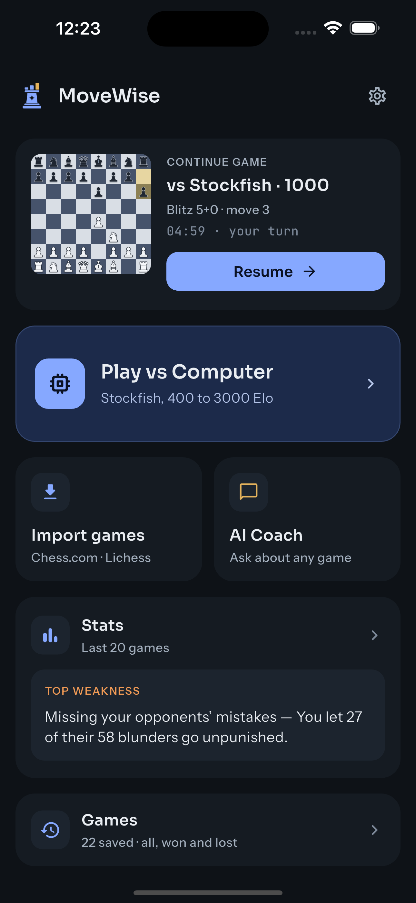
  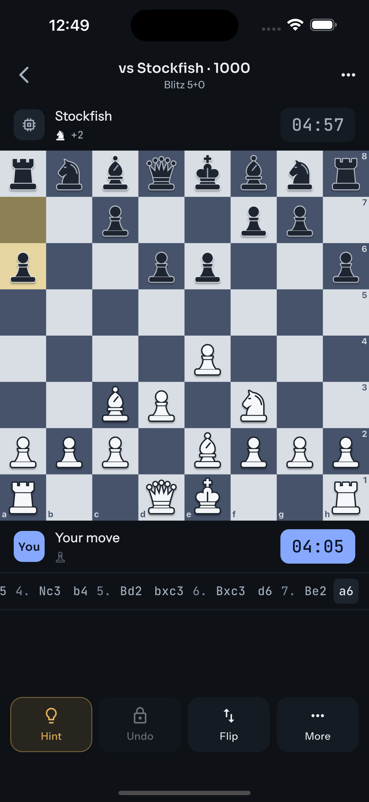
  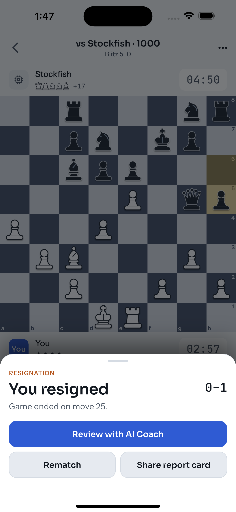
  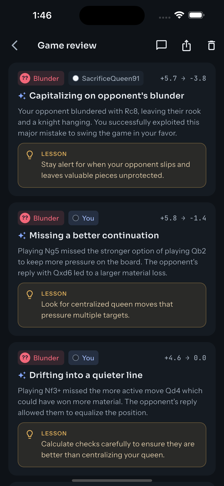
  <br>
  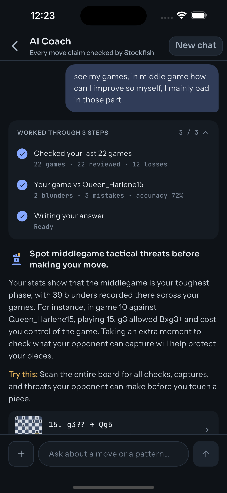
  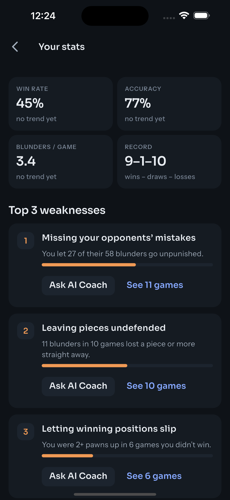
  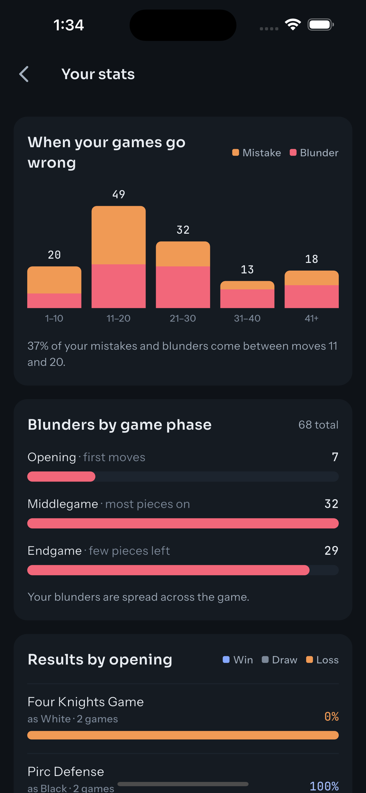
  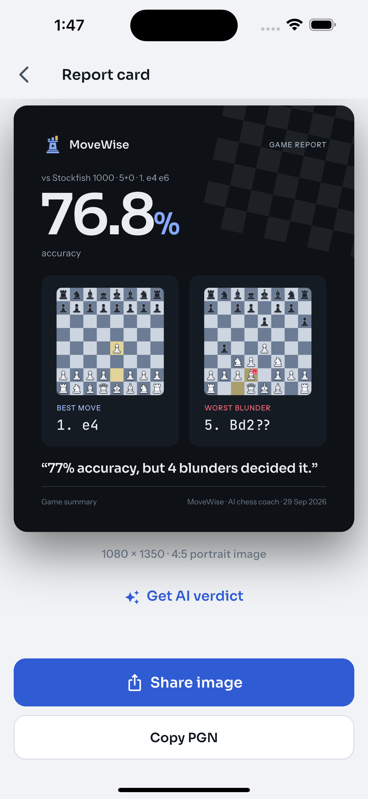
  <br>
  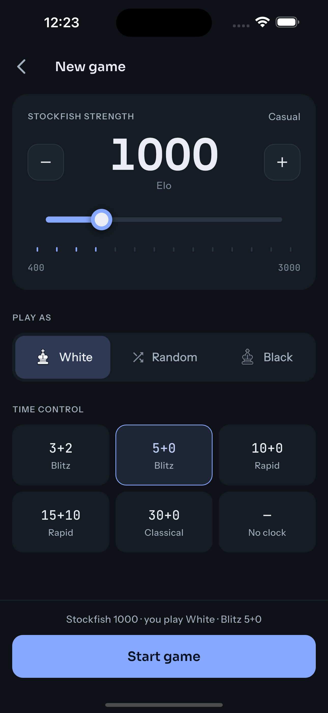
  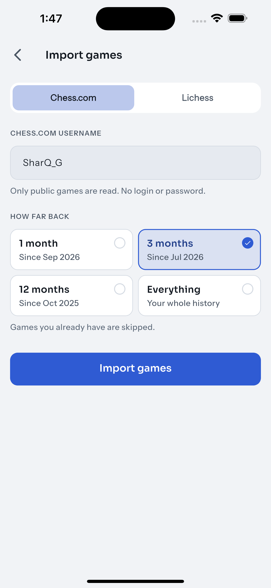
  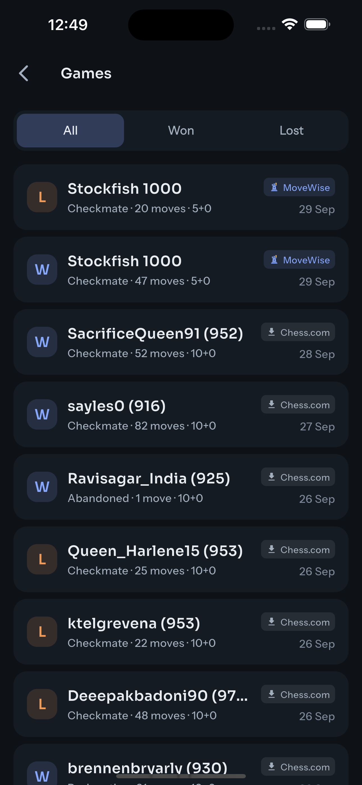
  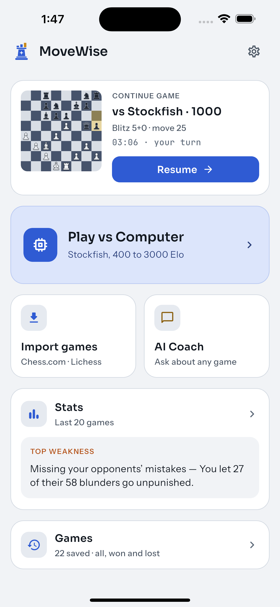
</p>

## What it does

| | |
|---|---|
| **Play** | Stockfish from 400 to 3000 Elo (step 200), your colour and time control. Clocks, hints, take-backs in practice mode, draw offers, every rule (castling, en passant, promotion, repetition, 50-move rule, insufficient material). |
| **Import** | Your public Chess.com and Lichess games by username (one per site, kept on the phone). No login; requests are one at a time, and later imports fetch only new games. |
| **Review** | Stockfish checks every move on the phone: accuracy, an evaluation graph and bar, moves marked `!!` `!` `?!` `?` `??`, and the key moments. One optional AI request explains them. |
| **AI Coach** | Ask anything about your games. A tool-calling agent looks at your games and asks Stockfish, and you watch each step as it happens. |
| **Stats** | Your top 3 weaknesses, when in a game things go wrong, blunders by phase, results by opening, personal bests. All computed on the phone. |
| **Report card** | A 1080 × 1350 image of a game (accuracy, best move, worst blunder, verdict) to share. |

## Architecture

Feature-first. Everything that talks to the outside world sits behind an
interface, so tests swap in fakes.

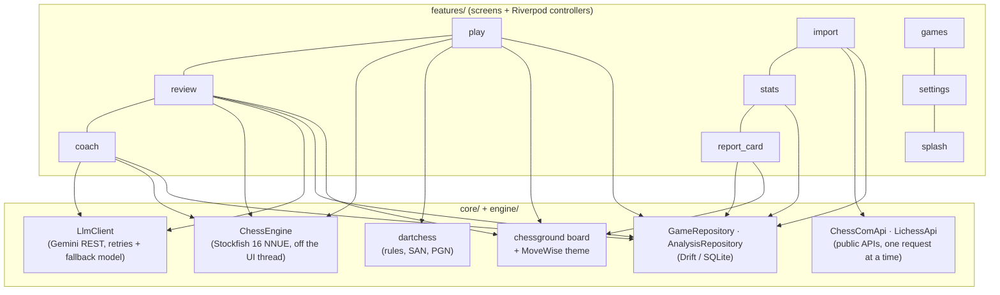

```
lib/
  core/       theme, board, routing, storage (Drift), llm, settings, motion
  engine/     Stockfish over UCI, Elo levels (one config file)
  features/   play · import · games · review · coach · stats · report_card · settings · splash
```

**Stack:** Flutter, Riverpod, go_router, Drift, dartchess, chessground,
multistockfish (Stockfish 16), Gemini over plain REST, share_plus.

## The AI Coach agent

The one agentic feature, a loop written by hand in Dart
([coach_agent.dart](lib/features/coach/domain/coach_agent.dart)).

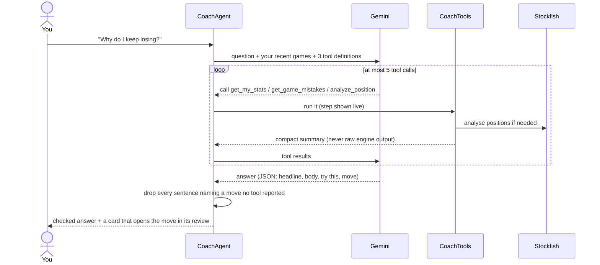

- **Tools:** `get_my_stats()`, `get_game_mistakes(game_id)`,
  `analyze_position(fen)`.
- **Budget:** at most 5 tool calls. After that the model must answer, so a
  question costs 2–6 model calls.
- **Grounding:** the prompt tells the model to use only moves from tool
  results. The code then checks: every move in the answer must be one the tools
  reported (legal in a position they looked at), or its sentence is removed.
  The move card must point to a move the tools described.
- **Live steps:** "Checking your last 20 games…", "Asking Stockfish about move
  23…", "Verified best move: Rd1".

The review's single AI call is checked the same way, and more strictly. Claims
of mate need a forced mate in Stockfish's lines. "Loses the queen" needs a
queen-sized material swing. Titles can't praise a mistake.

## How moves are judged

Loss against Stockfish's best move, in pawns (capped at ±10): **inaccuracy**
0.5–1.0, **mistake** 1.0–2.0, **blunder** over 2.0. `!` marks the one good move
(every alternative at least a pawn worse, with the game still in the balance).
`!!` marks a sound sacrifice. Accuracy is computed as Lichess does: each move
scores by how much it dropped your winning chances, and the game averages a
volatility-weighted mean with a harmonic mean, so a few blunders count as they
should instead of disappearing into a plain average.

## Running it

Requires Flutter 3.47+.

```sh
flutter pub get
flutter run
```

**Gemini key:** get a free key from https://aistudio.google.com/apikey and paste
it in Settings: turn on **Developer mode** at the bottom, and the **AI Coach**
section appears below it. It's kept in the iOS Keychain / Android encrypted
storage and never leaves the phone except in requests to Gemini. Without a key
everything works except the AI explanations and the AI Coach.

For development you can also pass a key at build time, used only when none is
saved in Settings:

```sh
cp .env.example .env          # add your key
flutter run --dart-define-from-file=.env
```

In VS Code, the launch configurations in `.vscode/launch.json` pass `.env` for
you.

**Free tier:** playing, importing, reviewing with Stockfish and stats make no
AI calls. Explaining a game is 1 call; a coach question is 2–6. Overloads and
short rate limits are retried with jittered backoff. A busy model, or one whose
free quota is used up, hands over to a lighter one (`GEMINI_MODEL`,
`GEMINI_FALLBACK_MODEL` in `.env`).

Debug builds compile Stockfish with optimisation (see `ios/Podfile` and
`android/build.gradle.kts`); without it the engine is about 17× slower.

## Tests

```sh
flutter analyze
flutter test
```

Tests cover the Elo mapping, move classification, special rules from FEN
positions, Chess.com parsing and import, the Gemini client (retries, fallback,
tool-call format), the coach loop with a fake model (tool cap, forced answer,
grounding), the weakness checks, the report card image size, and the screens.

Tools in `tool/` regenerate assets: `render_pieces.dart` (piece PNGs),
`make_sounds.py` (move sounds).
Icons and splash come from `flutter_launcher_icons.yaml` and
`flutter_native_splash.yaml`.

## Design

The full design (colour tokens, type, motion spec, every screen) is in
[`design/`](design/design-spec.md), made in Claude Design ("Night Study").
The piece set and the logo, the analyst's rook, are custom.

## Licence

Copyright (C) 2026 amitgp853

MoveWise is free software: you can redistribute it and/or modify it under the
terms of the [GNU General Public License v3.0](LICENSE) (GPL-3.0-only).

In short: you may run, study and change it. If you share it or a modified
version, in any form, you must share its full source under the same licence,
keep this copyright notice, and state what you changed. It comes with no
warranty.

It builds on these GPL-3.0 projects, which is why MoveWise uses the same
licence:

- [Stockfish](https://stockfishchess.org), via
  [multistockfish](https://github.com/lichess-org/dart-multistockfish)
- [dartchess](https://github.com/lichess-org/dartchess) and
  [chessground](https://github.com/lichess-org/flutter-chessground) from Lichess
- [sound_effect](https://github.com/lichess-org/flutter-sound-effect)

The MoveWise piece set, logo, design and board sounds are part of this
repository and covered by the same licence.
