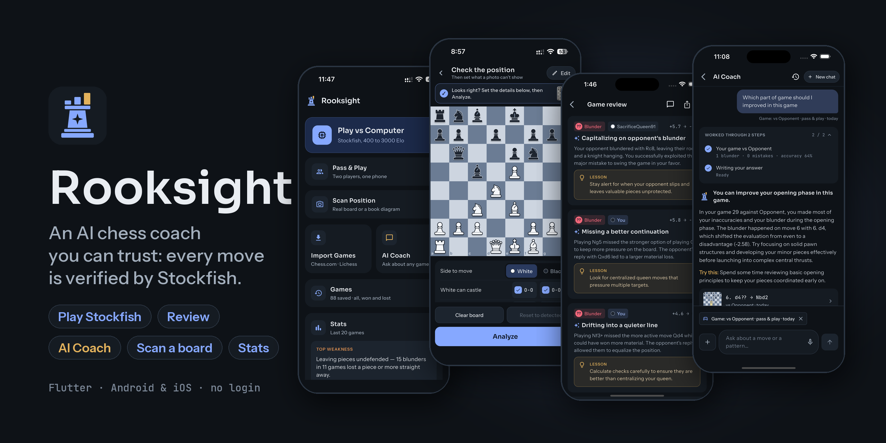
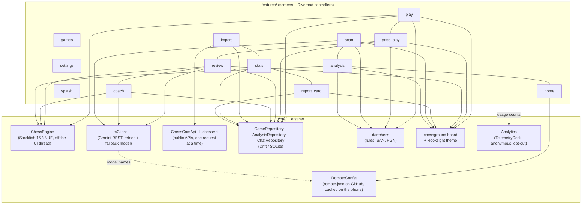
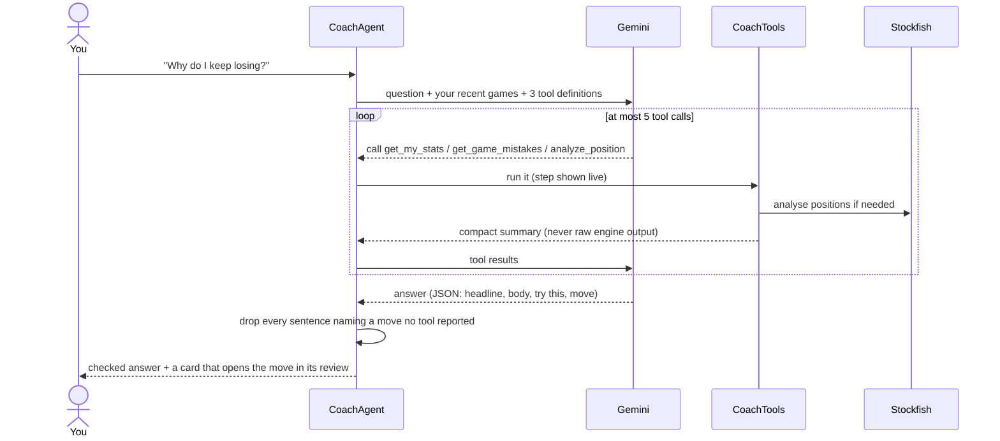

# Rooksight

**An AI chess coach you can trust: every move is verified by Stockfish.** Play Stockfish at your level, play a
friend on the same phone, or import your Chess.com and Lichess games. Every move is
reviewed by Stockfish on your phone, and you can ask the AI Coach why you keep losing,
then come back to that chat later. Every move the AI mentions is checked against the
engine and the rules before you see it.

Flutter · Android and iOS · no login, no backend, free to run ·
[support it on Ko-fi](https://ko-fi.com/amitgp853) · if you like it,
[give it a ⭐ on GitHub](https://github.com/amitgp853/rooksight).

<p align="center">
  
</p>

<p align="center"><b><a href="design/screenshots/README.md">See all screenshots →</a></b></p>

## What it does

| | |
|---|---|
| **Play** | Stockfish from 400 to 3000 Elo (step 200), your colour and time control. Only you are timed; Stockfish plays without a clock. Hints, take-backs in practice mode, draw offers, every rule (castling, en passant, promotion, repetition, 50-move rule, insufficient material). An unfinished game waits on Home. |
| **Pass & Play** | Two players on one phone, fully offline, both clocks running. The board turns for the player to move, or a face-to-face layout lets the phone lie flat between you (pieces turn to face whoever's move it is). Takebacks and draw offers need the other player's OK. Pause hides the board; "Save and finish later" keeps the game on Home. Finished games are saved from the first player's side and count in their stats. |
| **Import** | Your public Chess.com and Lichess games by username (one per site, kept on the phone). No login; requests are one at a time, and later imports fetch only new games. When a site asks to slow down, the import pauses with a live countdown (or "Try now") and carries on by itself. |
| **Scan a board** | Photograph a real board or a book diagram (or pick a photo), line the crop's 8 × 8 grid up with the squares, and Gemini reads the position (the same grid is drawn on the photo it sees, so it reads one square at a time) with your own key while you watch each step. If something doesn't add up (two white kings, a pawn on the back rank) it takes a second look at just those squares. Then check it: doubtful squares are marked, a side-by-side view compares with your photo, a piece palette fixes any square, and you set side to move and castling. Analyze stays off until the position is legal. Without a key, offline or out of quota, the same editor sets a position up by hand. The photo is never saved. Up to 20 scans a day, so your free quota lasts. |
| **Analysis board** | Any position from a scan, by hand, or "Analyze this position" in a review: Stockfish's eval (signed), win/draw/loss chances, its top 3 lines deepening live to depth 24, the best-move arrow, and a Threat arrow for what the other side wants. Play any move for either side; moves off the line become variations (long-press to promote, copy or delete), each marked `?!` `?` `??` against Stockfish's best, with Take back. Flip, copy FEN, share an image, play on from here vs Stockfish, or ask the AI Coach. Save a position (bookmark) to come back to it from Home: the moves you explore are kept as you go. |
| **Games** | Every game you played or imported, in one list: open its review, or delete it. |
| **Review** | Stockfish checks every move on the phone, at the depth you pick in Settings (Fast, Balanced or Deep): accuracy, an evaluation graph and bar, moves marked `!!` `!` `?!` `?` `??`, and the key moments. One optional AI request explains them. |
| **AI Coach** | Ask anything about your games, typed or spoken. A tool-calling agent looks at your games and asks Stockfish, and you watch each step as it happens. Chats are saved on the phone: search them, rename or delete them, and reopen one to carry on (opening a chat never runs the AI). |
| **Stats** | Your top 3 weaknesses, when in a game things go wrong, blunders by phase, results by opening, personal bests. All computed on the phone. |
| **Report card** | A 1080 × 1350 image of a game (accuracy, best move, worst blunder, verdict) to share. |

## Architecture

Feature-first. Everything that talks to the outside world sits behind an
interface, so tests swap in fakes.



```
lib/
  core/       theme, board, chess, routing, storage (Drift), llm, config (remote config),
              update, analytics, settings, motion, feedback, speech, widgets
  engine/     Stockfish over UCI, Elo levels (one config file)
  features/   home · play · pass_play · scan · analysis · import · games · review ·
              coach · stats · report_card · settings · splash
config/       remote.json: the app's remote settings (see below)
```

**Stack:** Flutter, Riverpod, go_router, Drift, dartchess, chessground,
multistockfish (Stockfish 16), Gemini over plain REST, camera and image_picker
(scan), speech_to_text (voice questions), share_plus, TelemetryDeck (usage counts).

## The AI Coach agent

The one agentic feature, a loop written by hand in Dart
([coach_agent.dart](lib/features/coach/domain/coach_agent.dart)).



- **Tools:** `get_my_stats()`, `get_game_mistakes(game_id)`,
  `analyze_position(fen)`.
- **Budget:** at most 5 tool calls. After that the model must answer, so a
  question costs 2–6 model calls.
- **Grounding:** the prompt tells the model to use only moves from tool
  results. The code then checks: every move in the answer must be one the tools
  reported (legal in a position they looked at), or its sentence is removed.
  The move card must point to a move the tools described.
- **Live steps:** "Checking your last 20 games…", "Asking Stockfish about move
  23…", "Verified best move: Rd1".
- **Memory:** a question carries the chat's last 5 questions and answers. Chats
  are saved on the phone (Drift), with the moves their tools verified, so a
  reopened chat can still mention them in follow-ups. Past about 2,000 tokens a
  chat is full and asks you to start a new one.

The review's single AI call is checked the same way, and more strictly. Claims
of mate need a forced mate in Stockfish's lines. "Loses the queen" needs a
queen-sized material swing. Titles can't praise a mistake.

## How moves are judged

Loss against Stockfish's best move, in pawns (capped at ±10): **inaccuracy**
0.5–1.0, **mistake** 1.0–2.0, **blunder** over 2.0. `!` marks the one good move
(every alternative at least a pawn worse, with the game still in the balance).
`!!` marks a sound sacrifice. Accuracy is computed as Lichess does: each move
scores by how much it dropped your winning chances, and the game averages a
volatility-weighted mean with a harmonic mean, so a few blunders count as they
should instead of disappearing into a plain average.

## Updates and remote config

There is no server. The app reads one small JSON file,
[`config/remote.json`](config/remote.json), from this repo on GitHub
([what each field does](config/README.md)):

- **Forced update:** a build below `minBuild` shows "Time to update" in place
  of the app, with a link to the store.
- **Optional update:** a build below `latestBuild` shows an "Update available"
  card on Home. "Later" hides it until the next build.
- **Gemini model:** switch every installed app to another model (or thinking
  level) without a release, e.g. when Google retires one. The built-in models
  stay as fallbacks, so a typo can't break the AI features.

It never slows the app down: the app opens on the copy saved last time (or its
built-in defaults) and fetches a fresh one after the first frame, at most once an
hour. Offline, nothing changes.

**Releasing a build:** bump the `+N` build number in `pubspec.yaml`. Once the build
is live in the store, raise `latestBuild` in `remote.json` (and `minBuild` too,
to make the update required), then push to `main`. Phones pick it up within
about an hour.

> The file is read from `raw.githubusercontent.com`, so the repo must be public
> for this to work. While it's private, every phone keeps its built-in values.

## Privacy: what leaves the phone

No account, and no server of our own. Games, reviews, chats and settings stay on
the phone. The app only talks to:

| Where | When | What is sent |
|---|---|---|
| Gemini | AI explanations, the AI Coach, scans | The question and the positions or photo involved, with your own key |
| Chess.com, Lichess | You import games | Your username on that site |
| GitHub | Launch, and back to the app (at most hourly) | Only a plain download of `remote.json` |
| TelemetryDeck | As you use the app, if the build has an app ID | Anonymous counts: "a game finished at 1400", "a scan worked", "a coach question was rate-limited". Never games, chats, usernames or keys. Turn it off in **Settings → Privacy**. |

## Running it

Requires Flutter 3.47+.

```sh
flutter pub get
flutter run
```

**Gemini key:** get a free key from https://aistudio.google.com/apikey and paste
it in **Settings → AI Coach**. Every place that needs the AI and has no key
shows a **Turn on AI coach (free)** button and an ⓘ that explains why the key is
yours and what the free tier covers. A paid key works too, with higher
limits. The key is kept in the iOS Keychain / Android encrypted storage and
never leaves the phone except in requests to Gemini. Without a key
everything works except the AI explanations and the AI Coach.

For development you can also pass a key at build time, used only when none is
saved in Settings:

```sh
cp .env.example .env          # add your key
flutter run --dart-define-from-file=.env
```

In VS Code, the launch configurations in `.vscode/launch.json` pass `.env` for
you.

**Usage stats (optional):** create a free app at
[TelemetryDeck](https://dashboard.telemetrydeck.com) and add
`TELEMETRYDECK_APP_ID` and `TELEMETRYDECK_NAMESPACE` to `.env`. Without them
nothing is sent and the Settings toggle is hidden. Debug builds send test
signals, which the dashboard keeps apart. Release builds need the same flag:

```sh
flutter build appbundle --dart-define-from-file=.env   # or: flutter build ipa
```

The Gemini key is never compiled into a release build; players add their own.

**Free tier:** playing (against Stockfish or a friend), importing, reviewing
with Stockfish, stats and reopening saved chats make no AI calls. Explaining a game is 1 call; a coach question is 2–6; a board scan is 1–2, read by the lighter model first (`GEMINI_FALLBACK_MODEL`, Flash-Lite), so scans don't use up the main model's quota (on the free tier, about 20 requests a day per model). Overloads and
short rate limits are retried with jittered backoff. A busy model, or one whose
free quota is used up, hands over to a lighter one. The models come from
`remote.json`. For development, setting `GEMINI_MODEL` in `.env` ignores the
remote models and uses yours (with `GEMINI_FALLBACK_MODEL` as the fallback).

Debug builds compile Stockfish with optimisation (see `ios/Podfile` and
`android/build.gradle.kts`); without it the engine is about 17× slower.

## Tests

```sh
flutter analyze
flutter test
```

Tests cover the Elo mapping, move classification, special rules from FEN
positions, the clocks (player-only against Stockfish, both sides in Pass & Play),
Pass & Play (takebacks, draw offers, pause, saving and resuming), Chess.com and
Lichess parsing and import, the Gemini client (retries, fallback, tool-call
format), the coach loop with a fake model (tool cap, forced answer, grounding),
saved chats (storage and migration, search, reopening without an AI call,
continuing with earlier moves), the weakness checks, the report card image size,
scanning (photo checks, position checks, the daily limit), the analysis board,
the remote config (parsing, bad values, caching, offline, refresh timing, model
fallbacks), forced and optional updates, the analytics categories, and the
screens.

Tools in `tool/` regenerate assets: `render_pieces.dart` (piece PNGs),
`make_sounds.py` (move sounds), `make_banner.py` (the README banner). `engine_probe.dart` prints Stockfish's UCI
traffic with timings on a real device.
Icons and splash come from `flutter_launcher_icons.yaml` and
`flutter_native_splash.yaml`.

## Design

The full design (colour tokens, type, motion spec, every screen) is in
[`design/`](design/design-spec.md), made in Claude Design ("Night Study").
The piece set and the logo, the analyst's rook, are custom.

## Support

Rooksight is free, open source and has no ads. If you like it:

- **Star the repo.** A ⭐ [on GitHub](https://github.com/amitgp853/rooksight) costs
  nothing and helps other chess players find it.
- **Buy me a coffee.** If it has helped you improve at chess, you can
  [support it on Ko-fi](https://ko-fi.com/amitgp853). The same link is in the app
  under **Settings → Support Rooksight**.

Thank you!

## Licence

Free and open source. Official builds and the Rooksight name are only from Amit Gupta.

Copyright (C) 2026 Amit Gupta. Rooksight is free software under the
[GNU General Public License v3.0 or later](LICENSE) (GPL-3.0-or-later): you may
run, study, change and share it. If you share it or a modified version, you must
share its full source under the same licence. It comes with no warranty.

- [LICENSE](LICENSE): the full GPL-3.0 text.
- [NOTICE](NOTICE): copyright, what the GPL covers, and the third-party software
  and fonts Rooksight uses (Stockfish, chessground and dartchess under GPL-3.0;
  Sora, Instrument Sans and JetBrains Mono under the OFL).
- [TRADEMARKS.md](TRADEMARKS.md): the Rooksight name and logo are trademarks and
  **not** under the GPL. Forks are welcome under a different name and logo.

The code, the piece set and the board sounds are under the GPL. The logo, app
icons and splash artwork are all rights reserved.

Contributions are accepted under the [Contributor License Agreement](CLA.md); see
[CONTRIBUTING.md](CONTRIBUTING.md).
