# Rooksight screenshots

[← Back to the README](../../README.md)

## Play

  
  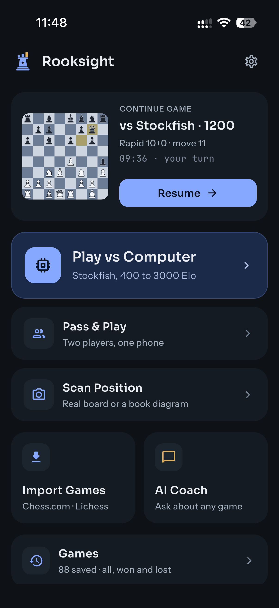
  
  
  

Home · an unfinished game waits on Home · new game setup · playing Stockfish (only your clock runs) · game over

## Pass & Play

  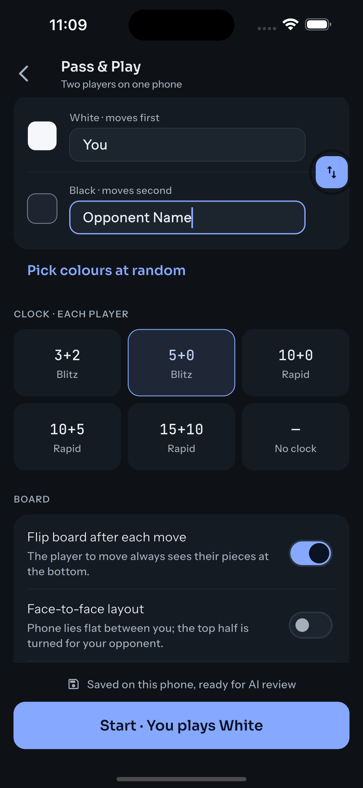
  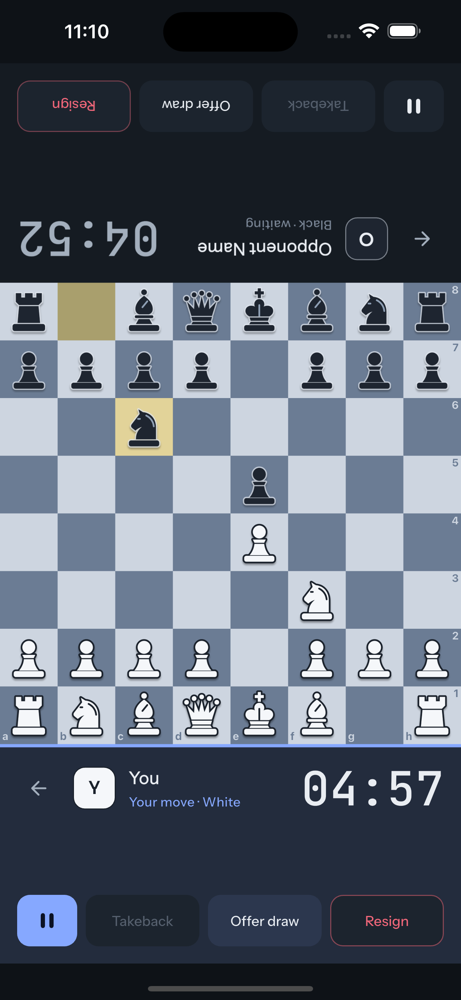
  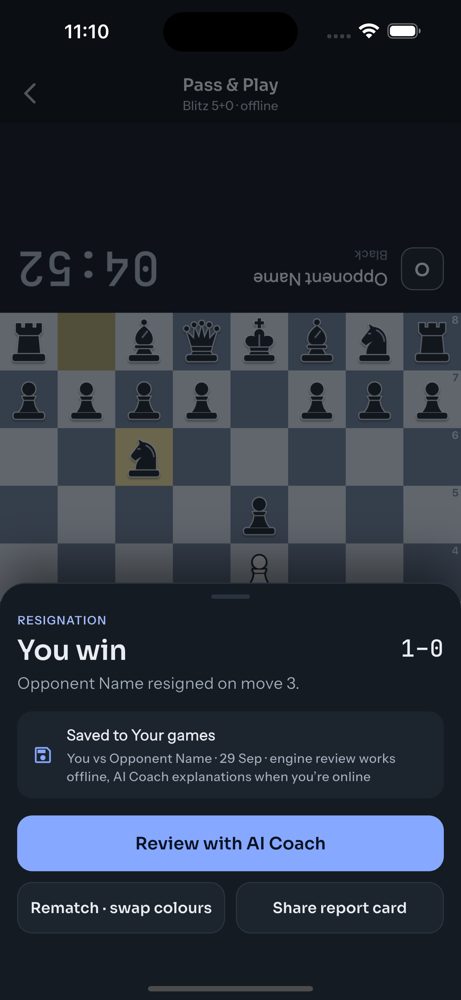

Setup · face to face on one phone · result, saved to your games

## Scan a board and analyse

  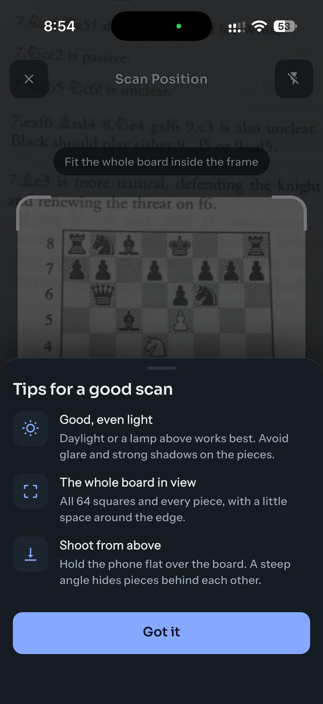
  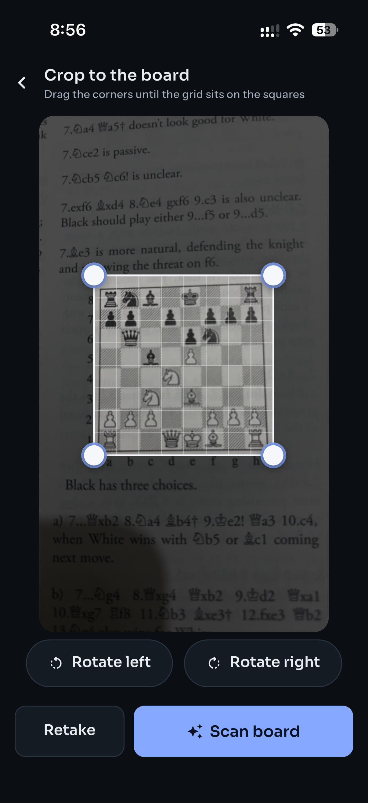
  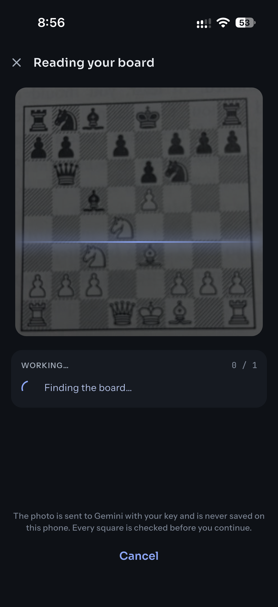
  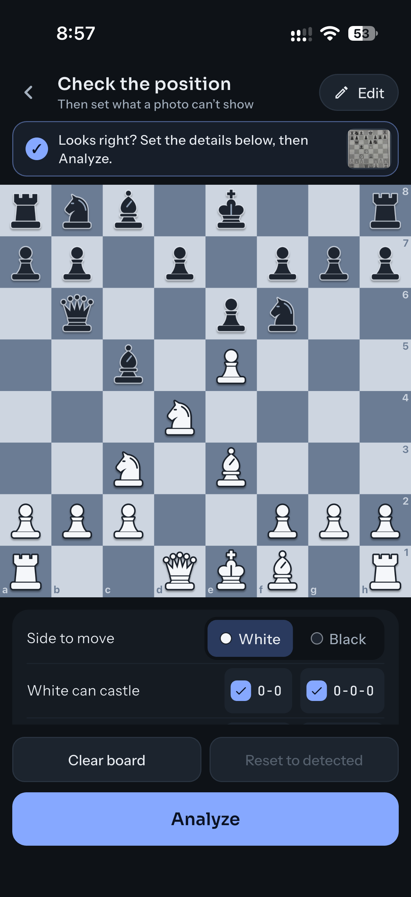

Tips for a good scan · crop to the board · reading the board, step by step · check the position

  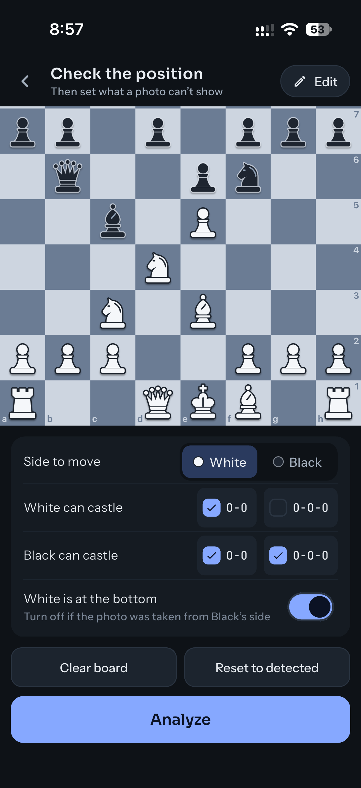
  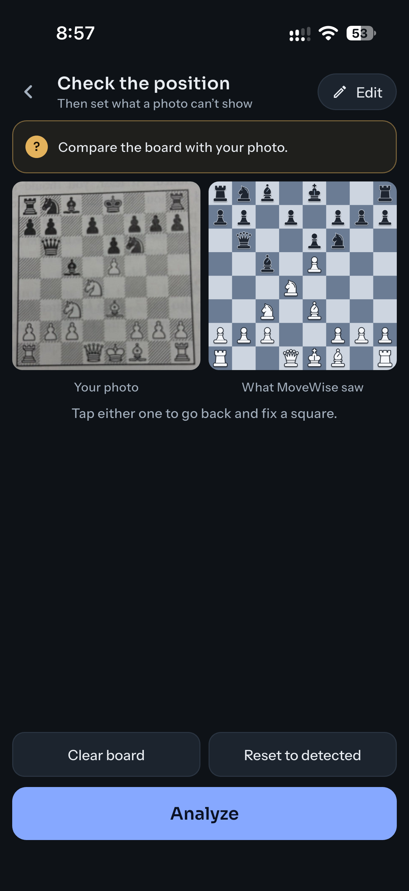
  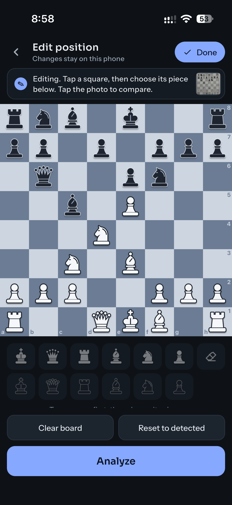
  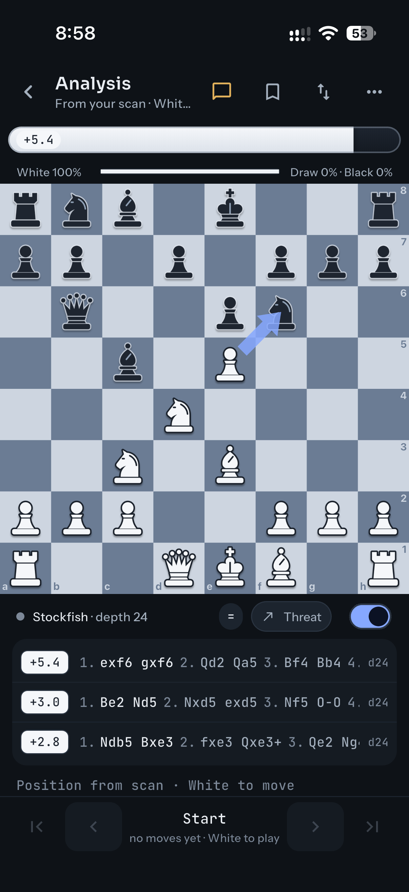

Side to move and castling · compare with your photo · fix any square · analysis board with Stockfish's top 3 lines

## Review

  
  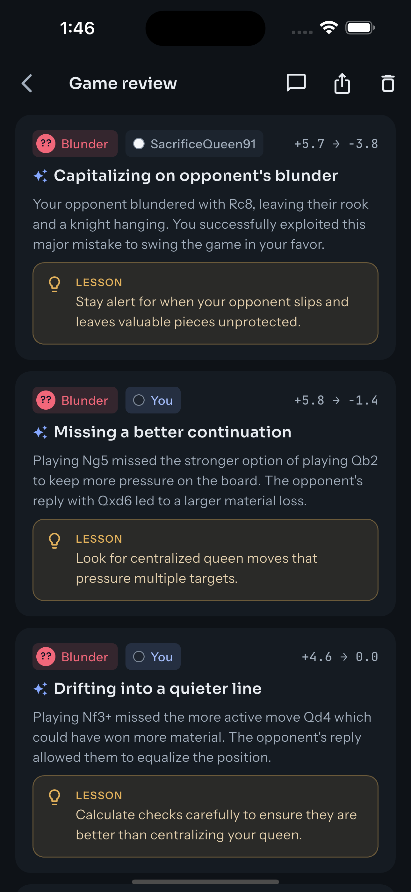
  

Game review with accuracy and move markers · key moments explained by the AI · shareable report card

## AI Coach

  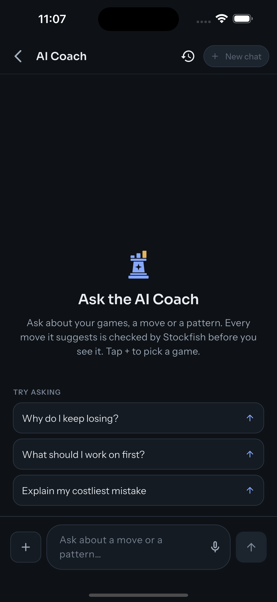
  
  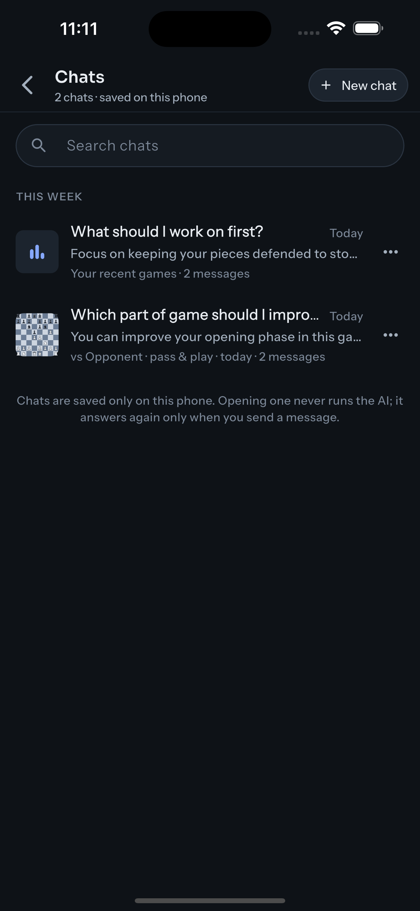
  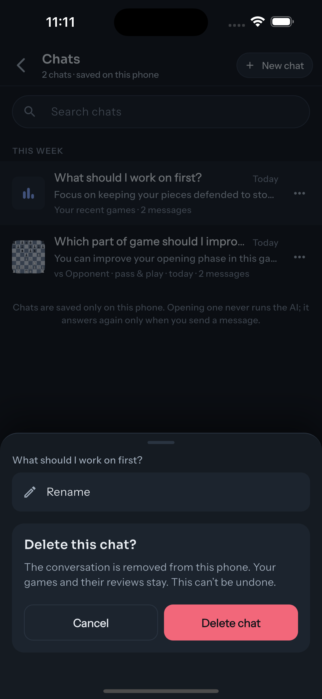

New chat · answering with its steps shown live · saved chats · rename or delete a chat

## Stats

  
  
  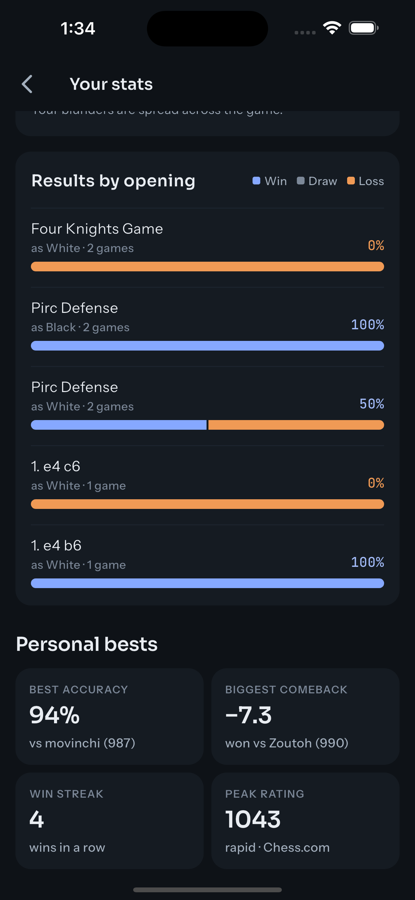

Top 3 weaknesses · when games go wrong · results by opening and personal bests

## Games, import and settings

  
  
  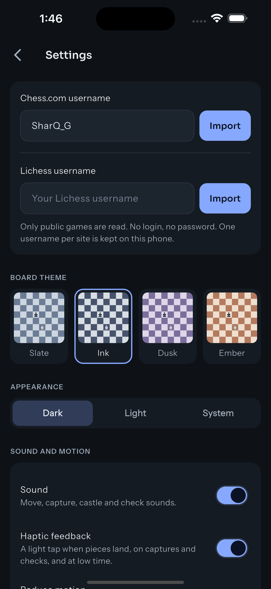
  

Game library with search, date and won/lost filters · Chess.com and Lichess import · settings · light mode
